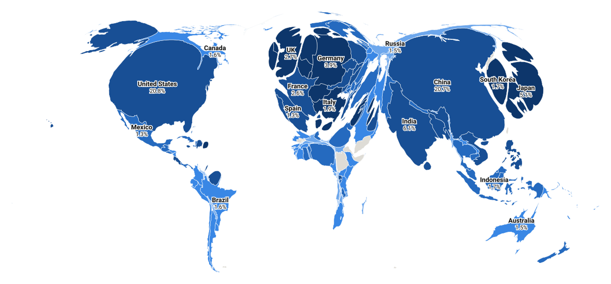

# A cartogram of global land value



Open [`figures/land_value_cartogram.html`](figures/land_value_cartogram.html)
for the interactive version with per-country figures and a table.

Every country's area is its share of world land value in 2020; colour is a
second quantity, land value per square kilometre of the country's *real*
surface. About **$201 trillion** across 210 countries and territories — roughly
2.3 times world GDP. The map draws the 165 of them that Natural Earth carries a
boundary for, $199tn of the total.

Two countries are two fifths of it. The United States is 20.6% and China 20.5%; the
top ten are 66.7%. Sub-Saharan Africa is 18.4% of the world's land surface and
3.8% of its land value.

Read the map for the shape of that concentration, not for any country's number.
Only about a sixth of the total is measured; the rest is a model, and the
sections below are about what that model can and cannot carry.

## Land value is not measured globally

Two record systems cover it, and they do not overlap.

**The World Bank's *Changing Wealth of Nations*** values agricultural land for
150 countries by capitalising crop and pasture rents — good coverage, but
farmland is a small share of what land is worth. It is 17.8% of the total here.

**National balance sheets** under SNA 2008 carry *all* land at market prices as
asset AN.211. That is the concept people mean by "land value", and eighteen
countries in the OECD's Table 9B report it for 2020.

So the interesting half of the quantity exists for eighteen countries, and the
question is whether it can be extended to the rest.

## The World Bank's urban land is a constant

CWON publishes produced capital twice, "including urban land" and "excluding
urban land", which looks like a free answer. It is not one. Over **3,858
country-years, 150 countries, 1995–2020**, the ratio of the two series is

```
1.2400000000    min = max,  sd = 2.4e-15
```

Urban land in CWON is 0.24 × produced capital — the same multiplier for every
country in every year, to machine precision. It is an assumption, not an
estimate, and it carries no country-level information that produced capital does
not already carry. Nothing here uses it.

(This repository has met the pattern before: 248 caja-years sharing a tax ratio
of exactly 0.11350 because output had been *derived* from receipts. See
[circularity-test.md](circularity-test.md). Same failure, four centuries apart —
a published series whose cross-sectional variation is an assumption.)

## The calibration sample is small, rich, and two members are unusable

Of the eighteen countries reporting AN.211 for 2020, two report **less total
land than the World Bank's farmland figure alone**:

| country | reported land | CWON farmland |
|---|---|---|
| Croatia | $3bn | $17bn |
| Mexico | $282bn | $359bn |

Those balance sheets do not cover all land, so subtracting farmland from them
would give a negative urban figure. Both are dropped. Fourteen remain:
Australia, Austria, Canada, Czechia, Estonia, Finland, France, Germany, Japan,
Korea, Netherlands, Slovakia, Sweden, the United Kingdom.

Every one is high-income. That is the sample the rest of the world is projected
from, and it is the single largest weakness in the map.

## The fit, and why the better-fitting one was rejected

Urban land value against GDP, both current US$, on those fourteen:

| | elasticity | R² | leave-one-out rmse (log) |
|---|---|---|---|
| free | **1.265** | 0.954 | 0.467 |
| pinned | 1.000 (k = 1.92) | 0.912 | 0.584 |

The free fit is better on both, and nothing improves it — urbanisation,
population density, GDP per capita and produced capital were all tried as second
regressors and none lowered the leave-one-out error. Across the sample the ratio
of urban land to GDP runs from 0.78 (Finland) to 4.65 (Korea).

The published series nevertheless uses the **pinned** model, urban land = 1.92 ×
GDP. An elasticity of 1.265 means the land-to-GDP ratio rises by a quarter with
every doubling of GDP, and the sample tops out at Japan's $5.2tn. Applied to the
United States — four times larger — it returns a ratio of 4.6, higher than
thirteen of the fourteen countries that were actually measured, purely because
the US economy is big. That is the extrapolation talking, not the data. The free
variant is kept in the CSV as `total_free_usd`; it puts world land value at
$306tn instead of $201tn.

## What the cartogram does, and the check that it worked

Outlines are projected to Equal Earth (equal-area, so the input areas mean
something), rasterised to a value-density grid of 3072 × 1536, and diffused to
uniform density by the Gastner–Newman method; every vertex is carried along the
flow. Boundaries are densified to 20 km before transport, because a straight
border with two endpoints cannot bend.

If it worked, each country's *final* area is its share of land value. That is
measurable, and `data/land/cartogram_area_check.csv` measures it:

- correlation of area share with value share: **0.99960**
- median absolute error **7.6%**; across the top 40 countries, **4.3%**
- by region, the largest gap between value share and drawn share is **0.52
  percentage points**

The errors that remain are the extreme contractions. Greenland has to shrink to
0.003% of the drawing and cannot get below a couple of grid cells, so it is
drawn about twenty times too large; Mongolia, Suriname and Bhutan fail the same
way. Every one of them is a country the map is asking to nearly vanish, and the
direction of the error is always the same — the emptiest places are drawn too
big, never too small.

## Inside countries: 4,405 states and provinces

[`figures/land_value_cartogram_subnational.html`](figures/land_value_cartogram_subnational.html)
is the same transform run on Natural Earth's admin-1 units instead of countries,
and it is zoomable — scroll to zoom, drag to pan, province labels appear as you
go in.

There is no sub-national land-value record to read either, so the national
figure is split by two rules:

    urban land value  ->  by population   (JRC GHS-POP 2020, 30 arc-second grid)
    farmland value    ->  by land area

Summing the 30-arc-second population grid inside each unit puts 7.71bn of the
grid's 7.84bn people inside an admin-1 unit (98.4%); the reallocation is exact,
with the largest country-level discrepancy at 3e-16.

What it buys is a range. National land value per km² spanned a factor of 21,880;
the units span **131 to 9.3bn US$ per km²**, a factor of 71 million, with Kowloon
City at the top. Concentration goes from "two countries are two fifths" to:

| | share of world land value |
|---|---|
| top 10 units | 13.8% |
| top 100 units | 53.4% |
| top 500 units | 79.6% |

California alone is 2.50% — about two thirds of all Sub-Saharan Africa (3.76%).
Then Texas 1.84%, Xinjiang 1.33%, Florida 1.30%, Guangdong 1.29%.

The area check holds up at this resolution: correlation 0.992, median absolute
error 7.3% across the top 200 units, and by country the largest gap between
value share and drawn share is 0.68 percentage points (Japan). Across all 4,405
the median error is 26%, which is the same resolution floor as before — a unit
whose target is a fraction of a grid cell cannot reach it.

Two drawing notes. The units are simplified as a **coverage**, not one at a
time: simplifying each polygon independently moves the two sides of a shared
border differently and opens a sliver of blank map along every internal
boundary. And the emptiest 49 units have their density floored at the 1st
percentile, or the flow through them would not stay finite.

**What the split is not.** It gives every state the same land value per resident
as its country, so it says where a country's people are, not what an acre there
sells for. It gets Tokyo, the US Northeast and the Chinese coast right for the
right reason. It cannot see that Manhattan outprices upstate New York, and it
assumes an Iowa acre and a Nevada acre are worth the same. Read it as a
population-weighted disaggregation, which is what it is.

## What this map cannot tell you

**Africa's share is a model output, not a measurement.** No low- or
middle-income country appears in the calibration sample. Their urban land is
1.92 × GDP because that is the rich-country average, and poorer countries
capitalise land at a lower multiple — thinner mortgage markets, weaker title,
less of the housing stock traded. The 3.8% is more likely an overstatement than
an understatement, and the same applies to every country outside the fourteen.

**China's 20.5% is 1.92 × GDP and nothing else.** China does not report AN.211.
The figure is not evidence about Chinese land prices; it is the world average
ratio applied to the world's second-largest economy.

**Land value is a stock at market prices**, so it moves with asset prices and
exchange rates, not just with the ground. 2020 is a single snapshot and a
strange year.

**Country totals hide everything that matters within a country.** Most of a
country's land value sits under a few cities. A national cartogram cannot show
that; the grid map in this directory spreads each country's total by
population, which is an allocation rule, not a price surface. What a real
price surface looks like — and how much of the world could have one — is
[`docs/us-land-value-cartogram.md`](us-land-value-cartogram.md).

## Files

| file | contents |
|---|---|
| `data/land/land_value_2020.csv` | per country: agricultural, urban, total, and the free-elasticity variant |
| `data/land/urban_land_calibration.csv` | the 18 AN.211 reporters, observed vs fitted, and which were used |
| `data/land/cartogram_area_check.csv` | value share against drawn area share, per country |
| `data/land/subnational_land_value.csv` | 4,405 states and provinces: population, area, farmland, urban, total |
| `data/land/cartogram_area_check_subnational.csv` | the same area check at unit level |
| `data/land/grid_cartogram_check.csv` | every equal-value tile: where it is, how much ground it covers, how big it was drawn |
| `data/land/inputs/` | the downloaded sources, unmodified |
| `docs/figures/land_value_cartogram.svg` | the figure |
| `docs/figures/land_value_cartogram.html` | interactive, with tooltips and a table |
| `docs/figures/land_value_cartogram_subnational.html` | zoomable, 4,405 units |
| `docs/figures/land_value_cartogram_grid.html` | zoomable, tiles of equal value on a 5.6 km grid |

## Reproducing

```bash
python3 src/land/fetch_inputs.py && python3 src/land/build_land_value.py && python3 src/land/make_cartogram.py && python3 src/land/build_subnational.py && python3 src/land/make_subnational_cartogram.py && python3 src/land/make_grid_cartogram.py
```

Needs `pandas`, `numpy`, `scipy`, `geopandas`, `shapely` (2.1+, for
`coverage_simplify`), `rasterio`, `requests`. `fetch_inputs.py` pulls a 480 MB
population raster for the sub-national step; the country and province
cartograms take under a minute each, the grid cartogram about fifteen.

`src/land/cartogram.py` is a standalone implementation of the diffusion
cartogram and has no dependency on the land data.

## Sources

- World Bank, *The Changing Wealth of Nations 2024*. Wealth Accounts, World Bank
  API source 59. CC BY 4.0.
- World Bank, World Development Indicators (GDP, population, exchange rates).
  CC BY 4.0.
- OECD, "Table 9B: Balance sheets for non-financial assets", dataflow
  `OECD.SDD.NAD:DSD_NASEC10@DF_TABLE9B`, asset N211N, sector S1.
- Natural Earth, `ne_110m_admin_0_countries` and
  `ne_10m_admin_1_states_provinces`. Public domain.
- European Commission JRC, GHS-POP R2023A, 30 arc-second grid, epoch 2020.
  CC BY 4.0.
- Michael T. Gastner and M. E. J. Newman, "Diffusion-based method for producing
  density-equalizing maps", *PNAS* 101:20 (2004), 7499–7504.
